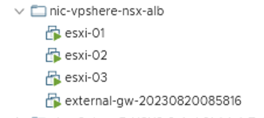

# nestedVsphere8

## Goal

This Infrastructure as code will deploy a nested ESXi/vCenter environment (on the top of vCenter environment which does not support 802.1q or vlan tagged).
Several deployments/scenarios are supported:
- vsphere_wo_nsx deploys a nested vSphere environment without NSX
- vsphere_alb_wo_nsx deploys a nested vSphere with and NSX ALB on the top
- vsphere_tanzu_alb_wo_nsx deploys a nested vSphere with Tanzu (VDS use case) and NSX ALB on the top
- vsphere_nsx deploys a nested vSphere included NSX (overlay use case)
- vsphere_nsx_alb deploys a nested vSphere included NSX (overlay use case) and NSX ALB on the top
- vsphere_nsx_tanzu_alb deploys a nested vSphere with Tanzu included NSX (overlay use case) and NSX ALB on the top
- vsphere_nsx_alb_telco deploys a nested vSphere included NSX (overlay use case) and NSX ALB (vCenter Cloud) with BGP between Service Engines and tiers 0 - TKGm is included and configured on the top of this along with AKO

You select the scenario/deployment based on the config-map that you will provide (see below).

All the variables are stored in K8s secrets (mostly credentials) and in a configmap for non-sensitive variables.

Regardless of the scenario that you want to use, the repo will always create the following nested infrastructure:

### Nested VM(s) connectivity

- if \.vsphere_underlay.networks_vsphere_dual_attached == false

- if \.vsphere_underlay.networks_vsphere_dual_attached == true

### Deployment Details

The amount of nested ESXi hosts is based on the amount of IP provided in .vsphere_underlay.networks.vsphere.management.esxi_ips.

The VM called external-gw-* acts as of:
- a DNS server
- a NTP server
- for deployment/scenario which includes NSX: it is the gateway between the tier0 and the external world providing source-NAT to allow the nested environment to access the Internet
- for deployment/scenario which includes K8s cluster (managed or non-managed): a single location to manage your K8s cluster via kubectl command

## How to consume this repo? - Where to get started?

The starting point to consume this repo is to have a K8s cluster to deploy the following:
- secrets
- config-map
- pod with the following connectivity:
  - to the Internet
  - to the web server(s) which contains the iso/ova files (defined in the config map)
  - to the outer/underlay vSphere API

Additionally, you need to have an external web server configured where the ISO/OVA files required will be downloaded.

Here are below the links of the yaml manifest (data model) file for the different deployments/scenarios:

### vsphere_wo_nsx
https://raw.githubusercontent.com/tacobayle/k8sYaml/master/nestedVsphere8_templates/secrets-vsphere_wo_nsx.yml
https://raw.githubusercontent.com/tacobayle/k8sYaml/master/nestedVsphere8_templates/cm-vsphere.yml
https://raw.githubusercontent.com/tacobayle/k8sYaml/master/nestedVsphere8_templates/pod-vsphere.y

### vsphere_alb_wo_nsx
https://raw.githubusercontent.com/tacobayle/k8sYaml/master/nestedVsphere8_templates/secrets-vsphere-alb.yml
https://raw.githubusercontent.com/tacobayle/k8sYaml/master/nestedVsphere8_templates/cm-vsphere-alb.yml
https://raw.githubusercontent.com/tacobayle/k8sYaml/master/nestedVsphere8_templates/pod-vsphere-alb.yml

### vsphere_tanzu_alb_wo_nsx
https://raw.githubusercontent.com/tacobayle/k8sYaml/master/nestedVsphere8_templates/secrets-vsphere-tanzu-alb-wo-nsx.yml
https://raw.githubusercontent.com/tacobayle/k8sYaml/master/nestedVsphere8_templates/cm-vsphere-tanzu-alb-wo-nsx.yml
https://raw.githubusercontent.com/tacobayle/k8sYaml/master/nestedVsphere8_templates/pod-vsphere-tanzu-alb-wo-nsx.yml

### vsphere_nsx
https://raw.githubusercontent.com/tacobayle/k8sYaml/master/nestedVsphere8_templates/secrets-vsphere-nsx.yml
https://raw.githubusercontent.com/tacobayle/k8sYaml/master/nestedVsphere8_templates/cm-vsphere-nsx.yml
https://raw.githubusercontent.com/tacobayle/k8sYaml/master/nestedVsphere8_templates/pod-vsphere-nsx.yml

### vsphere_nsx_alb
https://raw.githubusercontent.com/tacobayle/k8sYaml/master/nestedVsphere8_templates/secrets-vsphere-nsx-alb.yml
https://raw.githubusercontent.com/tacobayle/k8sYaml/master/nestedVsphere8_templates/cm-vsphere-nsx-alb.yml
https://raw.githubusercontent.com/tacobayle/k8sYaml/master/nestedVsphere8_templates/pod-vsphere-nsx-alb.yml

### vsphere_nsx_tanzu_alb
https://raw.githubusercontent.com/tacobayle/k8sYaml/master/nestedVsphere8_templates/secrets-vsphere-nsx-tanzu-alb.yml
https://raw.githubusercontent.com/tacobayle/k8sYaml/master/nestedVsphere8_templates/cm-vsphere-nsx-tanzu-alb.yml
https://raw.githubusercontent.com/tacobayle/k8sYaml/master/nestedVsphere8_templates/pod-vsphere-nsx-tanzu-alb.yml

### vsphere_nsx_alb_telco
https://raw.githubusercontent.com/tacobayle/k8sYaml/master/nestedVsphere8_templates/secrets-vsphere-nsx-alb-telco.yml
https://raw.githubusercontent.com/tacobayle/k8sYaml/master/nestedVsphere8_templates/cm-vsphere-nsx-alb-telco.yml
https://raw.githubusercontent.com/tacobayle/k8sYaml/master/nestedVsphere8_templates/pod-vsphere-nsx-alb-telco.yml

### vsphere_nsx_alb_vcd (under-dev)

### VM(s)

On the top of an underlay/outer vSphere, this repo will create the following VMs:

Regardless of the deployments/scenarios, all the other VM(s) will be deployed on the top of the nested environment.
Here are below a list of the VM(s) that will be deployed on the top of the nested environment:
- NSX manager
- NSX ALB controller
- Apps VM
- VM for unmanaged K8s clusters

Depending on the selected deployment/scenario, VMs deployed will vary. For example, all the scenarios/deployments "wo_nsx" will not include the NSX manager and its configuration.