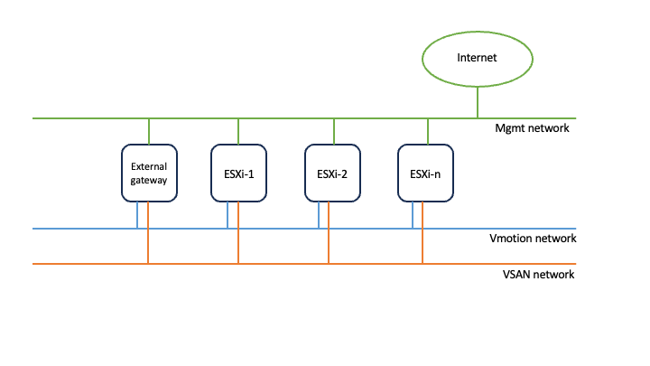

# nestedVsphere8

## Goal

This Infrastructure as code will deploy a nested ESXi/vCenter environment (on the top of vCenter environment which does not support 802.1q or vlan tagged).
Several deployments/scenarios are supported:
- vsphere_wo_nsx deploys a nested vsphere environment without NSX
- vsphere-alb deploys a nested vsphere with and NSX ALB on the top
- vsphere-nsx deploys a nested vsphere included NSX (overlay use case)
- vsphere-nsx-alb deploys a nested vsphere included NSX (overlay use case) and NSX ALB on the top

## How to consume this repo? - Prerequisites
The starting point to consume this repo is to have a K8s cluster.
You need to deploy:
- secrets
- config-map
- pod

Additionally, you need to have an external web server configured where the ISO/OVA files needed will be downloaded.

All the variables are stored in K8s secrets (mostly passwords) and in one configmap for non-sensitive variables.

Here are below the links of the yaml manifest file examples for the different deployments/scenarios:

### vsphere_wo_nsx
https://raw.githubusercontent.com/tacobayle/k8sYaml/master/nestedVsphere8/secrets-vsphere_wo_nsx.yml
https://raw.githubusercontent.com/tacobayle/k8sYaml/master/nestedVsphere8/cm-vsphere.yml
https://raw.githubusercontent.com/tacobayle/k8sYaml/master/nestedVsphere8/pod-vsphere.yml

### vsphere-alb
https://raw.githubusercontent.com/tacobayle/k8sYaml/master/nestedVsphere8/secrets-vsphere-alb.yml
https://raw.githubusercontent.com/tacobayle/k8sYaml/master/nestedVsphere8/cm-vsphere-alb.yml
https://raw.githubusercontent.com/tacobayle/k8sYaml/master/nestedVsphere8/pod-vsphere-alb.yml

### vsphere-nsx
https://raw.githubusercontent.com/tacobayle/k8sYaml/master/nestedVsphere8/secrets-vsphere-nsx.yml
https://raw.githubusercontent.com/tacobayle/k8sYaml/master/nestedVsphere8/cm-vsphere-nsx.yml
https://raw.githubusercontent.com/tacobayle/k8sYaml/master/nestedVsphere8/pod-vsphere-nsx.yml

### vsphere-nsx-alb

## shared resources regardless of the deployments/scenarios

### VM(s)

On the top of an underlay/outer vSphere, this repo will create the following VMs:

### VM(s) connectivity

